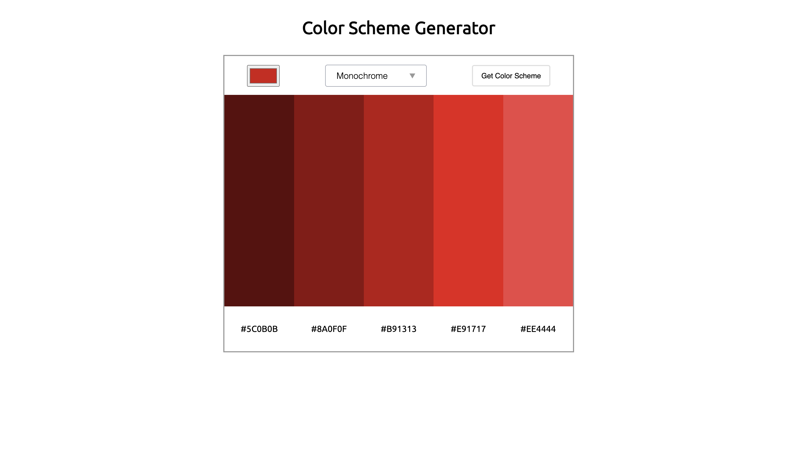

## Color Scheme Generator
This is a simple web app which generates Color Scheme based on the hex values that we select and you can copy values by clicking on the colors. 

It uses API to generate the schemes from https://www.thecolorapi.com/ 

Built with simple HTML5, CSS3 and vanilla JavaScript.

[ Let's Try in Live :)](https://gmarav05.github.io/color-scheme-generator/)

## Video

https://github.com/user-attachments/assets/163597f7-7c6f-4616-ad38-8d9d93b6621d

## Image

## Features

- Uses API to generate the color scheme.

- It has different colors to choose from color picker.

- It also has different types of modes like Monochrome, Analogic etc.

- You can click on the color to copy the hex value into clipboard.

## Learnings

- Practise of Calling API's.

- Intentionally used more eventlisteners to practice some DOM.

- Copyt to clipboard. 

- Practise Responsive Design using values like %, rem, em.

## Live demo

[ View Live  :)](https://gmarav05.github.io/color-scheme-generator/)
 
